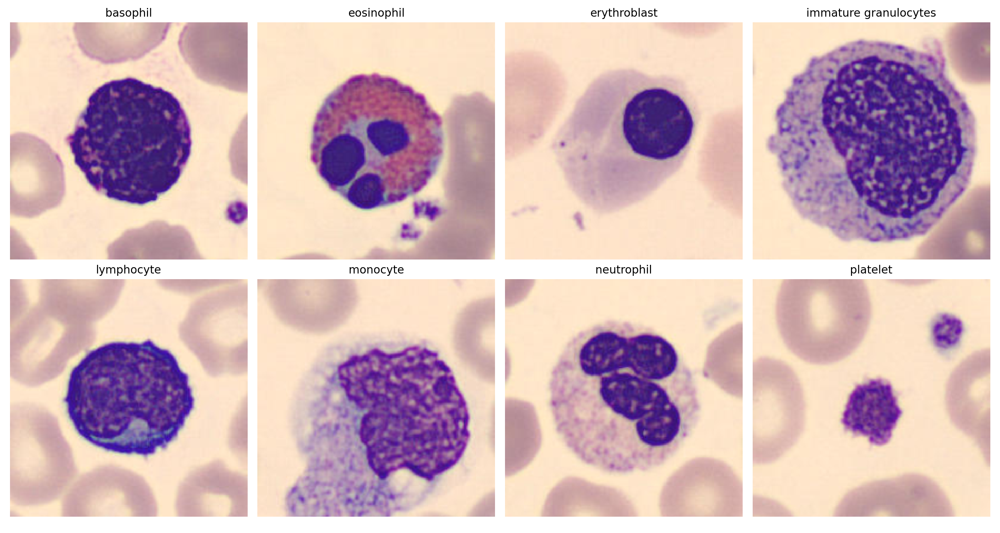

# Blood Cell Classification

In this project, we successfully classified 96x96 RGB images of blood cells into eight distinct classes, each representing a particular cell state. This multi-class classification problem required us to assign the correct class label to each RGB image.

## Team OverfittingExorcists

- [Daniele Laganà](https://github.com/danielelagana)
- [Marcello Martini](https://link.marcellomartini.tech/)
- [Gianluigi Palmisano](https://github.com/Gianlu01k)
- [Samuele Pozzani](https://github.com/sampozz)

## Folder content

```bash
Blood Cells classification
├── AN2DL Homework 1 - OverfittingExorcists.pdf
├── Data exploration and Cleaning.ipynb
├── EfficientNetV2S Mixed Augmentation.ipynb
├── EfficientNetV2S RandAugment.ipynb
├── README.md
├── bloodcells-dataset-sample.png
└── model.py
```

- **AN2DL Homework 1 - OverfittingExorcists.pdf**: The project report detailing the methodology and results.
- **Data exploration and Cleaning.ipynb**: Jupyter notebook for data exploration and preprocessing.
- **EfficientNetV2S Mixed Augmentation.ipynb**: Jupyter notebook for training the model using mixed augmentation techniques.
- **EfficientNetV2S RandAugment.ipynb**: Jupyter notebook for training the model using RandAugment techniques.
- **model.py**: Python class containing the implementation of the model and related functions for Test Time Augmentation and model Ensemble prediction.

## Dataset Details



- **Image Size:** 96x96
- **Color Space:** RGB (3 channels)
- **Input Shape:** (96, 96, 3)
- **File Format:** npz (Numpy archive)
- **Number of Classes:** 8

## Class Labels

- 0: Basophil
- 1: Eosinophil
- 2: Erythroblast
- 3: Immature granulocytes
- 4: Lymphocyte
- 5: Monocyte
- 6: Neutrophil
- 7: Platelet

## Dataset Structure

The training data is provided in the `train_data.npz` file, which contains:

- **images:** A Numpy array of shape (13759, 96, 96, 3) containing the RGB images.
- **labels:** A Numpy array of shape (13759,), with class values ranging from 0 to 7, corresponding to the classes listed above.

The training dataset is available in the course folder under the Homework 1 subdirectory. You can access it from the start of the homework.