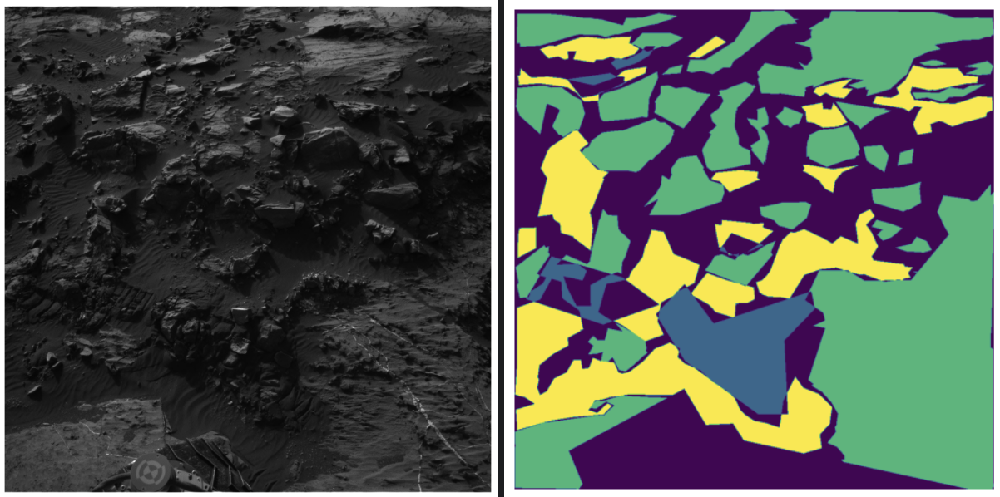

# Martian Terrain Semantic Segmentation 🪐🔍

In this project, we developed an ensemble model for segmenting Martian terrain images. The ensemble combines multiple U-Net models with custom enhancements to improve segmentation accuracy.

## Team 👨🏻‍💻🚀

- [Daniele Laganà](https://github.com/danielelagana)
- [Marcello Martini](https://link.marcellomartini.tech/)
- [Gianluigi Palmisano](https://github.com/Gianlu01k)
- [Samuele Pozzani](https://github.com/sampozz)

## Folder content 🗂️

```bash
Martian Terrain Semantic Segmentation
├── AN2DL Homework 2 - OverfittingExorcists.pdf
├── homework-2-aug-classw-residual-fusion-redlr.ipynb
├── homework2-classweights-augs.ipynb
├── homework2-combined-loss.ipynb
├── homework2-ensemble.ipynb
├── README.md
└── mars-dataset-sample.png
```

- **AN2DL Homework 2 - OverfittingExorcists.pdf**: The project report detailing the methodology and results.
- **homework2-aug-classw-residual-fusion-redlr.ipynb**: Jupyter notebook implementing a U-Net model with residual blocks, feature fusion, and advanced augmentations.
- **homework2-classweights-augs.ipynb**: Jupyter notebook for training the U-Net model with class weights and data augmentations.
- **homework2-combined-loss.ipynb**: Jupyter notebook for training the U-Net model with a combined loss function.
- **homework2-ensemble.ipynb**: Jupyter notebook for creating an ensemble of multiple U-Net models and generating predictions.


## Dataset Details 🔎



- **Image Size:** 64x128
- **Color Space:** Grayscale (1 channel)
- **Input Shape:** (64, 128, 1)
- **File Format:** npz (Numpy archive)
- **Number of Classes:** 5

## Class Labels 🏷️

- **0:** Background
- **1:** Soil
- **2:** Bedrock
- **3:** Sand
- **4:** Big Rock